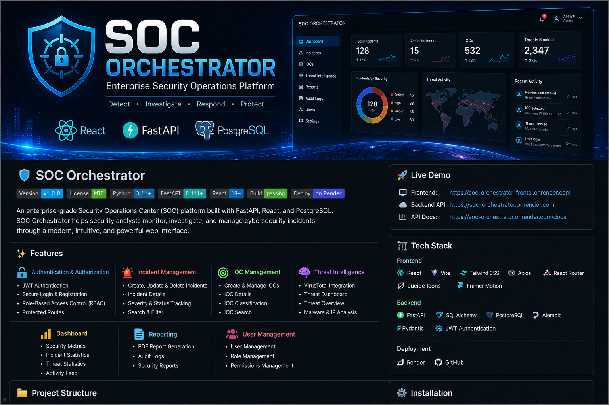

<p align="center">
  
</p>

# 🛡️ SOC Orchestrator

An enterprise-grade Security Operations Center (SOC) platform built with **FastAPI**, **React**, and **PostgreSQL**.

SOC Orchestrator helps security analysts monitor, investigate, and manage cybersecurity incidents through a modern web interface.

---

## 🚀 Live Demo

- **Frontend:** https://soc-orchestrator-frontend.onrender.com
- **Backend API:** https://soc-orchestrator.onrender.com
- **API Documentation:** https://soc-orchestrator.onrender.com/docs

---

## ✨ Features

### 🔐 Authentication & Authorization

- JWT Authentication
- Secure Login & Registration
- Role-Based Access Control (RBAC)
- Protected Routes

### 🚨 Incident Management

- Create, Update & Delete Incidents
- Incident Details
- Severity & Status Tracking
- Search & Filter

### 🎯 IOC Management

- Create & Manage Indicators of Compromise
- IOC Details
- IOC Classification
- IOC Search

### 🧠 Threat Intelligence

- VirusTotal Integration
- Threat Dashboard
- Threat Overview

### 📊 Dashboard

- Security Metrics
- Incident Statistics
- Threat Statistics
- Activity Feed

### 📄 Reporting

- PDF Report Generation
- Audit Logs
- Security Reports

---

## 🖥️ Screenshots

> Screenshots will be added soon.

- Landing Page
- Login
- Register
- Dashboard
- Incident Management
- IOC Management
- Threat Dashboard
- Reports

---

## 🏗️ Tech Stack

### Frontend

- React
- Vite
- Tailwind CSS
- Axios
- React Router
- Framer Motion
- Lucide React

### Backend

- FastAPI
- SQLAlchemy
- PostgreSQL
- Alembic
- JWT Authentication
- Pydantic

### Deployment

- Render
- GitHub

---

## 📂 Project Structure

```text
soc-orchestrator/
│
├── backend/
│
├── frontend/
│   ├── src/
│   ├── public/
│   ├── assets/
│   │   └── soc-orchestrator-banner.png
│   ├── package.json
│   └── vite.config.js
│
└── README.md
```

---

## ⚙️ Installation

### Clone Repository

```bash
git clone https://github.com/bayadsaad-dot/soc-orchestrator.git

cd soc-orchestrator
```

### Backend

```bash
cd backend

python -m venv venv

venv\Scripts\activate

pip install -r requirements.txt

uvicorn app.main:app --reload
```

### Frontend

```bash
cd frontend

npm install

npm run dev
```

---

## 🔑 Environment Variables

### Backend

```env
DATABASE_URL=your_database_url
SECRET_KEY=your_secret_key
ALGORITHM=HS256
ACCESS_TOKEN_EXPIRE_MINUTES=60
VT_API_KEY=your_virustotal_api_key
```

### Frontend

```env
VITE_API_URL=http://localhost:8000
```

---

## 📚 API Documentation

Swagger UI:

https://soc-orchestrator.onrender.com/docs

---

## 🎯 Future Improvements

- Email Verification
- Forgot Password
- WebSocket Notifications
- Docker Support
- Kubernetes Deployment
- MITRE ATT&CK Integration
- AI Incident Assistant

---

## 👨‍💻 Author

**Saad Byad**

- GitHub: https://github.com/bayadsaad-dot

---

## ⭐ Support

If you like this project, please give it a ⭐ on GitHub.
